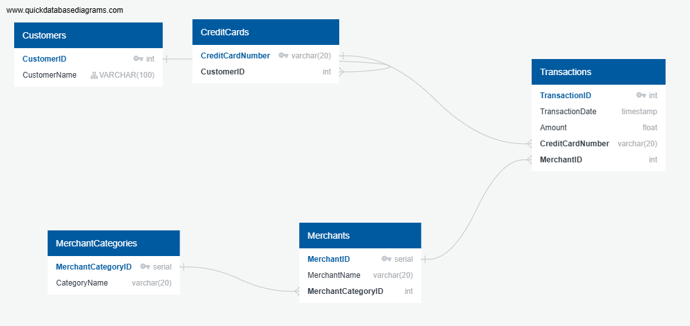
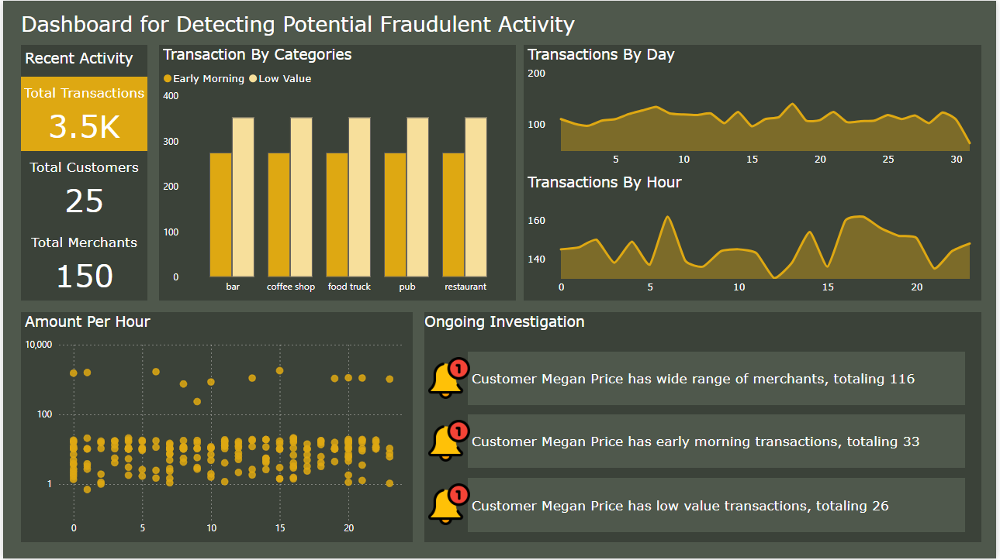

# Fraud Detection


*[Credit Card Fraudster by Richard Patterson](https://www.flickr.com/photos/136770128@N07/42252105582/) | [Creative Commons Licensed](https://creativecommons.org/licenses/by/2.0/)*

## Background

Fraud is a prevalent issue affecting businesses of all sizes, from small taco shops to large international corporations. While advanced technologies like machine learning and artificial intelligence are increasingly used to detect fraud, robust data analytics remain essential for identifying unusual charges.

This project applies SQL skills to analyze historical credit card transactions and consumption patterns to identify potential fraudulent activities.

### Tools and Technologies

- SQL
- PostgreSQL
- Entity Relationship Diagrams (ERDs)
- Python
- Pandas
- Plotly Express
- SQLAlchemy

### Project Tasks

1. **Data Modeling**:
   - Define a database model to store credit card transaction data.
   - Create a new PostgreSQL database using this model.
   - **Tool used**: [Quick Database Diagrams](https://app.quickdatabasediagrams.com/#/) to develop ERD.

    

2. **Data Engineering**:
   - Create a database schema in PostgreSQL.
   - Populate the database using provided CSV files.

3. **Data Analysis**:
   - Analyze the data to identify possible fraudulent transactions:
     - Find the top 100 highest transactions during early morning hours (7-9 AM).
     - Count transactions less than $2.00 per cardholder to check for hacked cards.
     - Identify the top 5 merchants prone to being hacked with small transactions.
     - Create views for reusable queries.
     - Create a report for fraudulent transactions of top customers using Python and data visualization libraries.
     - Analyze outlier/anomalous transactions using techniques like standard deviation and interquartile range.
   - Using PowerBI to Build a Dashboard for Fraud Detection

    

### Summary of Column Definitions

#### Customers Table
- **CustomerID**: Unique integer identifier for each customer  (auto-incremented).
- **CustomerName**: Customer's name, up to 100 characters.

#### CreditCards Table
- **CreditCardNumber**: Unique string identifier for each credit card, up to 20 characters.
- **CustomerID**: Foreign key linking to `Customers.CustomerID`.

#### MerchantCategories Table
- **MerchantCategoryID**: Unique integer identifier for each merchant category (auto-incremented).
- **CategoryName**: Name of the merchant category, up to 20 characters, cannot be empty.

#### Merchants Table
- **MerchantID**: Unique integer identifier for each merchant (auto-incremented).
- **MerchantName**: Merchant's name, up to 100 characters, cannot be empty.
- **MerchantCategoryID**: Foreign key linking to `MerchantCategories.MerchantCategoryID`.

#### Transactions Table
- **TransactionID**: Unique integer identifier for each transaction (auto-incremented).
- **TransactionDate**: Date and time of the transaction, must be valid.
- **Amount**: Transaction amount, must be greater than 0.
- **CreditCardNumber**: Foreign key linking to `CreditCards.CreditCardNumber`.
- **MerchantID**: Foreign key linking to `Merchants.MerchantID`.

#### Index
- **idx_Customers_CustomerName**: Index on the `CustomerName` column in the `Customers` table.

## Setup Instructions

### Prerequisites

- PostgreSQL installed on your machine.
- Python 3.12 installed on your machine.
- Required Python packages listed in `requirements.txt`.

### Steps

1. **Clone the Repository**:

    ```sh
    git clone https://github.com/yourusername/fraud-detection.git
    cd fraud-detection
    ```

2. **Set Up the Database**:

   - **Start PostgreSQL and create a new database:**
  
    ```sh
    CREATE DATABASE fraud_detection;
    ```

   - **Run the schema and seed files** to set up the database structure and populate it with initial data:
  
    ```sh
    psql -d fraud_detection -f sql/schemas.sql
    psql -d fraud_detection -f sql/seed_data.sql
    ```

   - **Run the functions and triggers file** to create necessary functions and triggers in the database:
  
    ```sh
    psql -d fraud_detection -f sql/functions.sql
    psql -d fraud_detection -f sql/triggers.sql
    ```

   - **Run the views file** to create reusable queries in the database:
  
    ```sh
    psql -d fraud_detection -f sql/views.sql
    ```

   - **Run the queries file** to understand and retrieve information from the database:
  
    ```sh
    psql -d fraud_detection -f sql/queries.sql
    ```

3. **Install Python Dependencies:**

    ```sh
    pip install -r requirements.txt
    ```

4. **Run the Jupyter Notebook**:

   - Navigate to the notebooks directory and start Jupyter Notebook:
  
    ```sh
    cd notebooks
    jupyter notebook
    ```

   - Open `exploratory_data_analysis.ipynb` to start analyzing the data.
